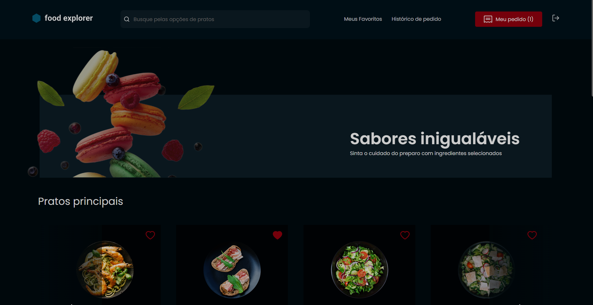
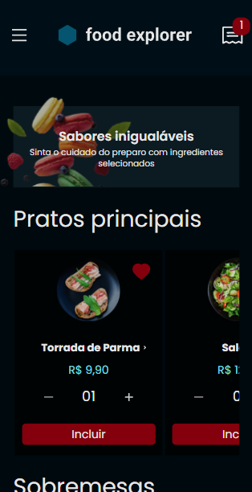

<h1>Food Explorer</h1>

> responsive website

<h2>Description</h2>

> This project simulates a restaurant with main dishes, desserts and drinks. Food Explorer has two personas: the USER adm and the common user.

* This project is making use of ApiFood, repository:
https://github.com/Romeusorionaet/ApiFood

* To make use of this application it will be necessary to clone this repository and ApiFood.

> To start on both: npm run dev

<h2>Common User</h2>

* View registered dishes
* Include dishes in order list
* Favorite dishes
* View the history of your orders.

>  To have access as a common user:
* Name: example
* E-mail: example@gmail.com
* Password: 123

<h2>Adm User</h2>

> The adm user is the person responsible for the restaurant, so you can:

* View registered dishes
* Register dishes
* Edit dishes
* Delete dishes

> To have access as adm user:

* Login: useradm@gmail.com
* Password: 123

<h2>Tecnology</h2>

* [React](https://react.dev/)
* [JavaScript](https://developer.mozilla.org/pt-BR/docs/Web/JavaScript)
* [Vite](https://vitejs.dev/)
* [Axios](https://axios-http.com/)
* [HTML ](https://developer.mozilla.org/pt-BR/docs/Web/HTML)
* [styled-components](https://styled-components.com/)
* [react-elastic-carousel](https://www.npmjs.com/package/react-elastic-carousel)
* [react-icons](https://react-icons.github.io/react-icons/)
* [react-spinners](https://www.davidhu.io/react-spinners/)

<h2>Contact</h2>

* [LinkedIn](https://www.linkedin.com/in/romeu-soares-87749a231/)
* WhatsApp: 84 981127596